# Architecture diagrams

Every diagram below was derived by reading the code, not from the design intent. Names, endpoints,
table columns, status strings and polling intervals are the real ones — if a diagram disagrees with
the code, the code has changed and the diagram is a bug.

Rendered natively by GitHub. `docs/architecture.html` is a standalone viewer for the same content.

**Contents**

1. [Process map — system context](#1-process-map--system-context)
2. [Component diagram (UML)](#2-component-diagram-uml)
3. [The three-language CLI chain](#3-the-three-language-cli-chain)
4. [Flowchart — migration engine decision tree](#4-flowchart--migration-engine-decision-tree)
5. [Data flow diagram — level 0](#5-data-flow-diagram--level-0)
6. [Data flow diagram — level 1](#6-data-flow-diagram--level-1-migrate)
7. [Sequence — drag-and-drop migration](#7-sequence--drag-and-drop-migration)
8. [Sequence — whole-schema batch](#8-sequence--whole-schema-batch)
9. [Sequence — AI Command](#9-sequence--ai-command-planconfirmexecute)
10. [Sequence — reconcile](#10-sequence--reconcile-dispatch-vs-completion)
11. [ER diagram](#11-er-diagram--sqlite)
12. [Class diagram (UML)](#12-class-diagram-uml)
13. [State diagrams](#13-state-diagrams)
14. [Block diagram — runtime topology](#14-block-diagram--runtime-topology)
15. [Polling map](#15-polling-map)

---

## 1. Process map — system context

Four external systems. Two are read-only sources, one is the write target, one is the tool chain.

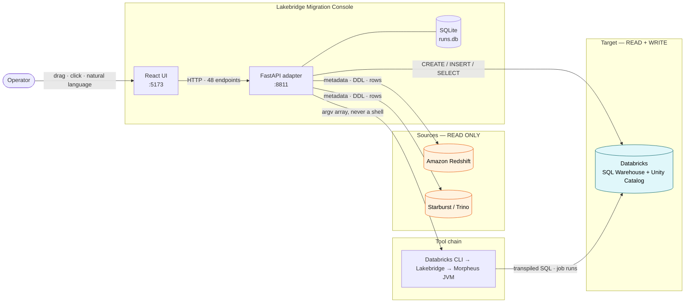

**Boundary contract.** Nothing is ever written to Redshift or Starburst. Every write lands in
`lakebridge_demo.g3_migrations` on Databricks. Every string crossing back out of a connector passes
through `redact()` first.

---

## 2. Component diagram (UML)

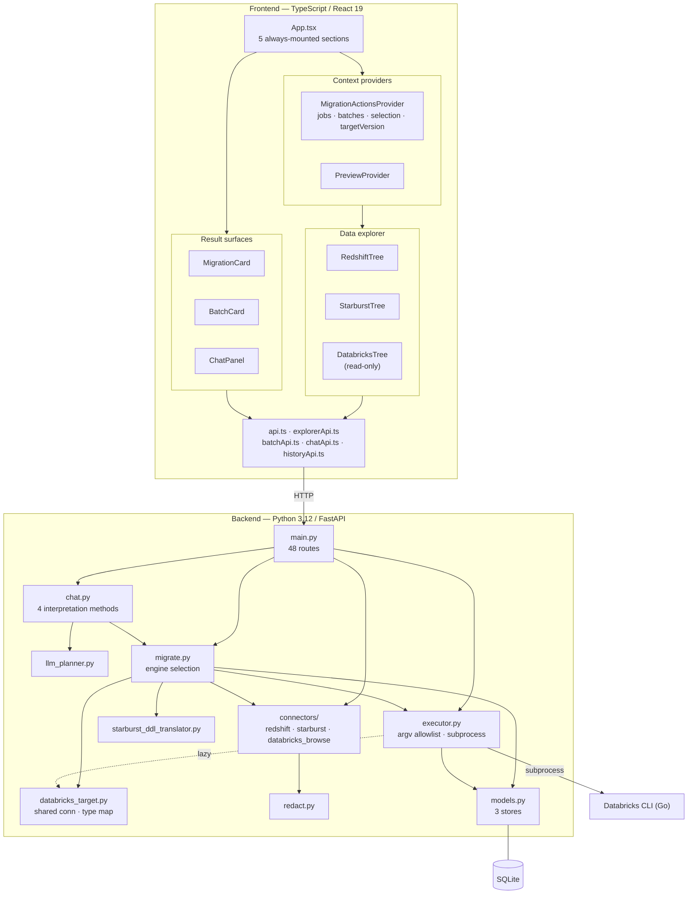

`redact.py` and `models.py` are leaves. `executor` and `databricks_target` sit above them, `migrate`
above `executor`, `chat` above `migrate`, `main` on top. **No cycles** — `migrate` imports
`JOB_RUN_URL_RE` and `poll_job_run` *from* `executor`, never the reverse, and `executor` imports
`databricks_target` lazily inside one function so a non-reconcile command never loads the SQL driver.

---

## 3. The three-language CLI chain

The single most misunderstood part of the system, and the direct cause of two real production bugs.

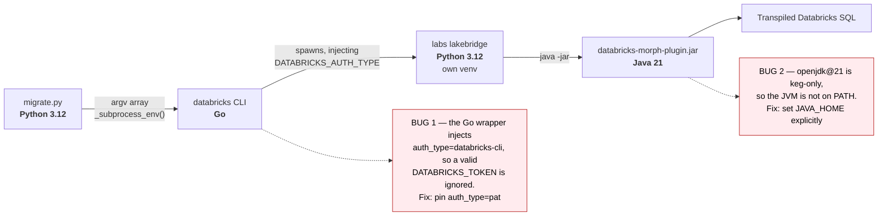

---

## 4. Flowchart — migration engine decision tree

How `(source_system, object_type)` selects one of four engines.

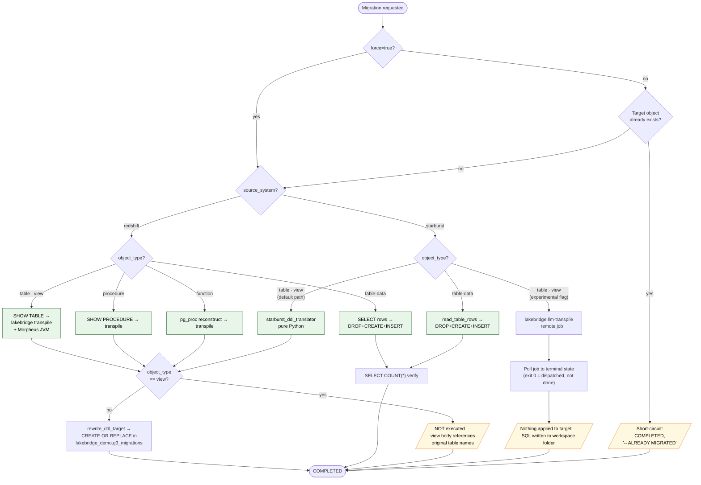

| Engine (`migrations.engine`) | Source | Mechanism |
|---|---|---|
| `lakebridge-transpile` | Redshift | CLI `transpile` + Morpheus JVM — deterministic |
| `starburst-custom-ddl` | Starburst | pure-Python translator — deterministic, seconds |
| `llm-transpile-experimental` | Starburst | CLI `llm-transpile` → remote job — non-deterministic, 5+ min |
| `data-copy` | either | connector `SELECT` → `databricks_target` — not Lakebridge at all |

**Two deliberate non-writes**, both visible above: a transpiled **view** is stored but never executed
(its body references source-side names that do not exist in the flat `{system}_{schema}_{name}`
target convention), and the **LLM path** never applies anything to the target.

---

## 5. Data flow diagram — level 0

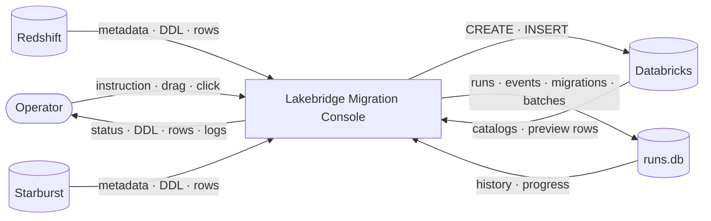

## 6. Data flow diagram — level 1 (migrate)

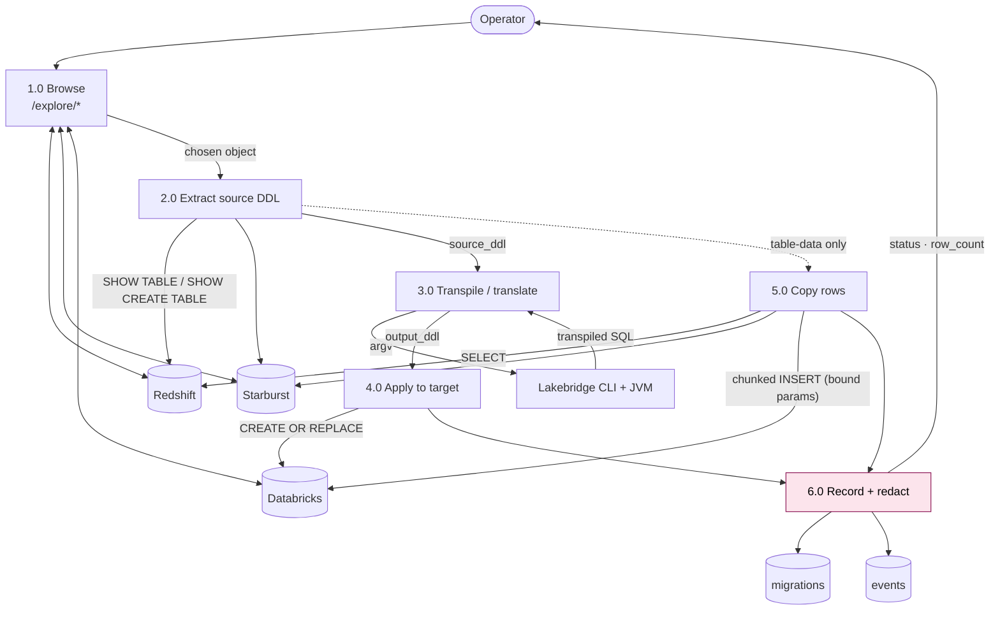

**Process 6.0 is the trust boundary.** No text reaches `events.message` or `migrations.error`
without passing `redact()`; CLI output passes `strip_ansi()` first.

---

## 7. Sequence — drag-and-drop migration

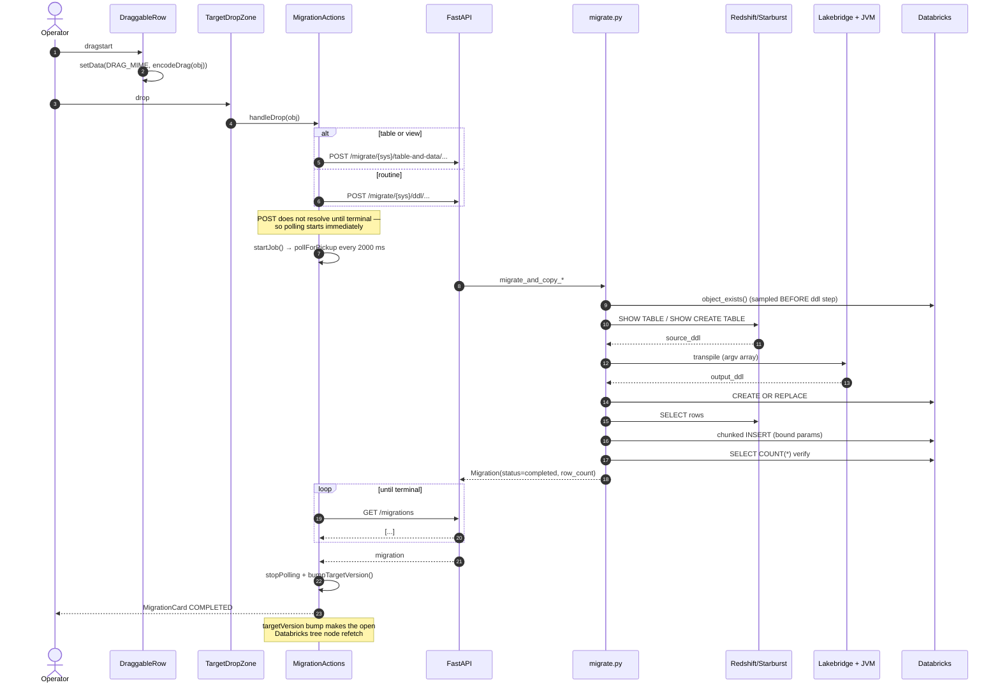

## 8. Sequence — whole-schema batch

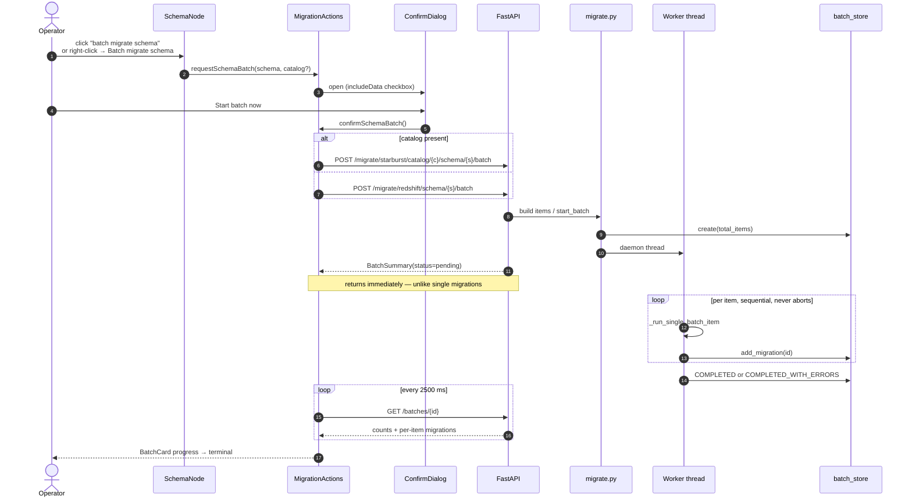

A batch **never aborts on a failed item** — a per-item exception synthesises a FAILED Migration and
the loop continues. The terminal status is `completed_with_errors` rather than `completed`, which is
why a failure can never be presented as a plain success.

## 9. Sequence — AI Command (plan→confirm→execute)

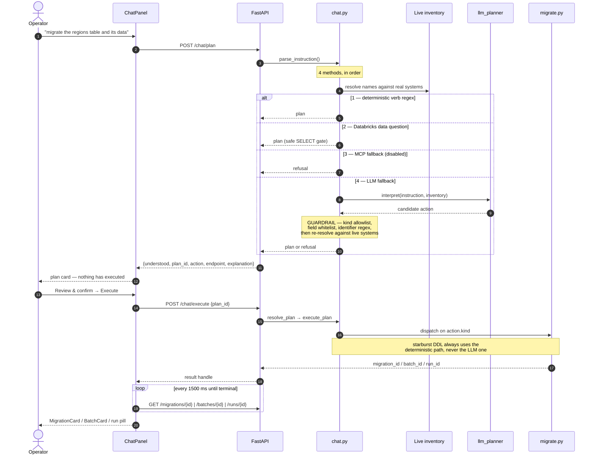

**The plan step never executes anything.** Refusal is the default: ambiguity, type-hint conflicts and
unresolvable names all return `understood: false` rather than a guess.

## 10. Sequence — reconcile (dispatch vs completion)

The one flow where CLI exit code 0 does **not** mean "finished".

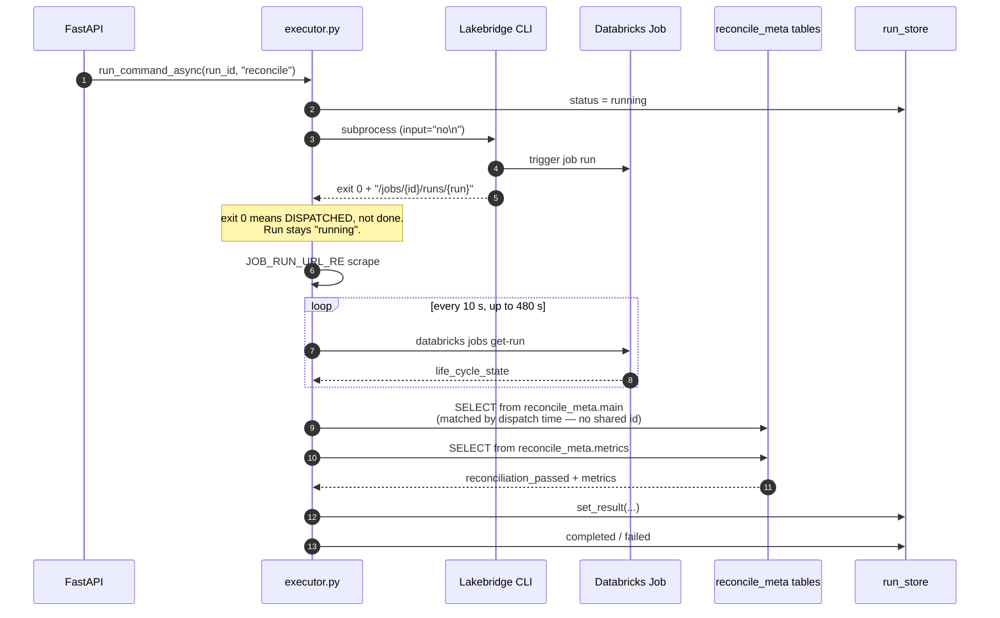

`reconciliation_passed` is deliberately **separate** from the Run's completed/failed: a genuine data
mismatch is a *successful run with a negative verdict*, not a technical failure.

---

## 11. ER diagram — SQLite

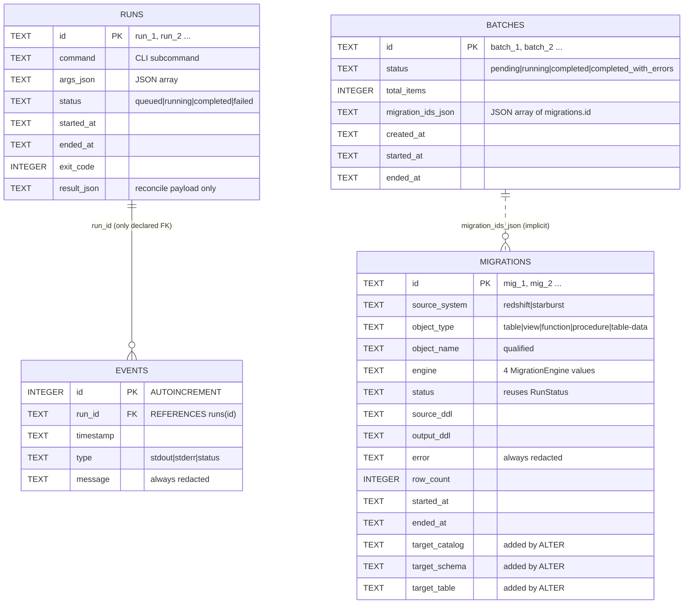

Three facts a naive reading would get wrong:

- **`runs` and `migrations` are unrelated.** No column links them. A `Run` is one CLI invocation; a
  `Migration` is an extract → transpile → apply. They share only the `RunStatus` enum.
- **`batches` → `migrations` is not a foreign key.** There is no `batch_id` column on `migrations`;
  the link is a JSON array on the parent, appended one id at a time.
- **`migrations.target_*` exist only via `ALTER TABLE`.** They were never added back into the
  `CREATE TABLE` text, so a fresh database still gets them from the idempotent retrofit path.

`events.run_id` is the only declared FK, and SQLite does not enforce it — `PRAGMA foreign_keys=ON`
is never issued.

---

## 12. Class diagram (UML)

### Backend

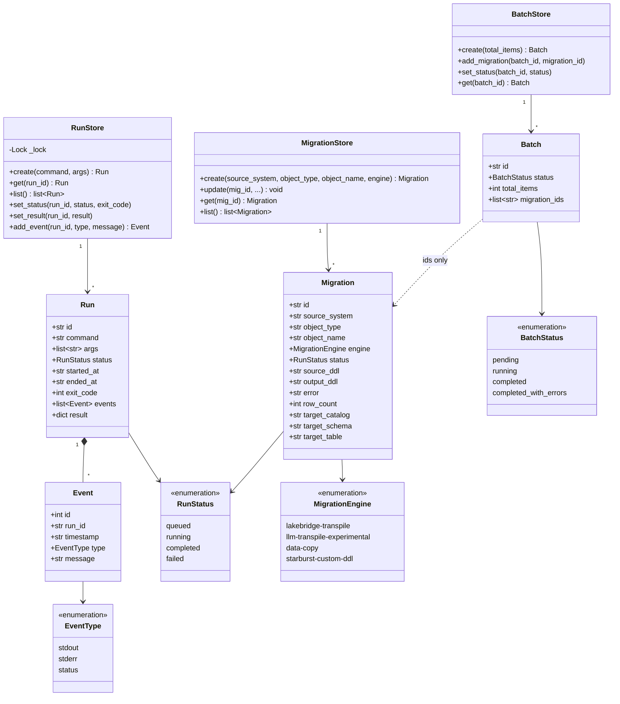

### Frontend types

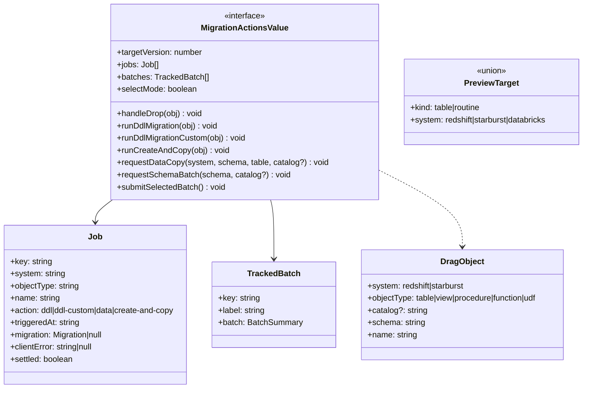

---

## 13. State diagrams

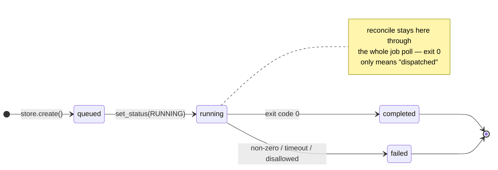

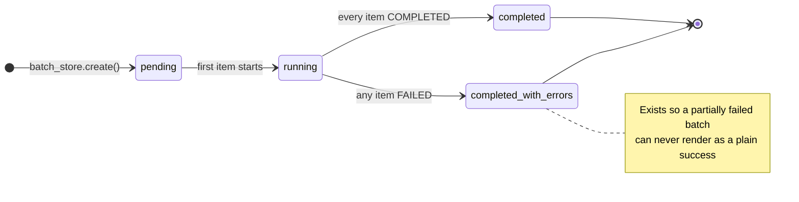

---

## 14. Block diagram — runtime topology

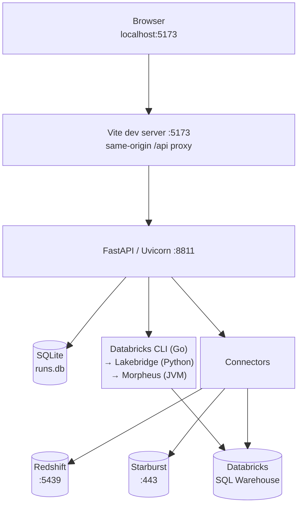

Through a dev tunnel or Codespace, **only 5173 is forwarded**. The frontend detects a non-localhost
origin and routes through Vite's same-origin `/api` proxy, which avoids both mixed-content blocking
and the tunnel's anti-phishing interstitial.

---

## 15. Polling map

Every timer in the frontend, with what stops it.

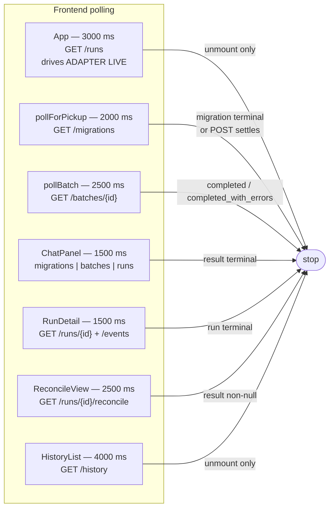

`pollForPickup` exists because the migrate `POST` does **not** resolve until the migration reaches a
terminal state — without polling, the UI would show nothing at all for the entire run.
